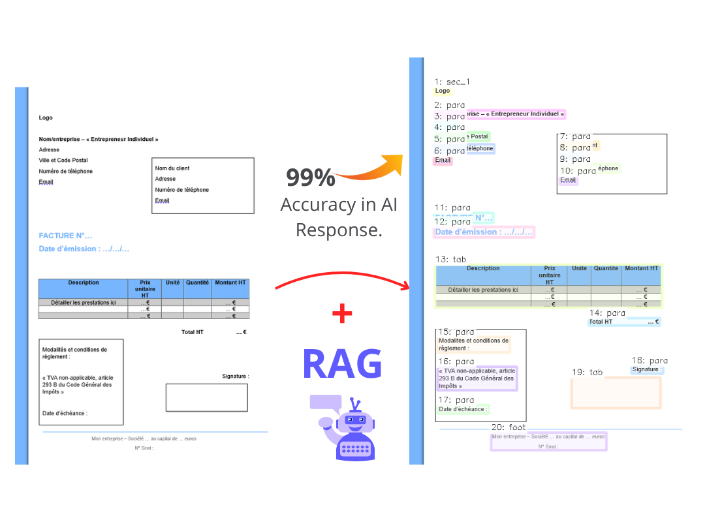

# RAG_advanced — Frontend & Backend Guide

This project provides a document processing workflow with a retrieval-augmented generation (RAG) API and a React frontend. You can upload documents, index extracted content, and ask questions grounded in the document with citations.

<p align="center">
  
</p>

## Demo

https://github.com/user-attachments/assets/upwork.webm

https://github.com/mouncefik/Advanced-Rag/raw/main/upwork.webm

<video src="upwork.webm" controls width="800"></video>

- Backend: FastAPI app under `Ragdee/` with a RAG service powered by OpenAI.
- Frontend: Vite + React app under `frontend/` with a three-section UI.

## Overview

- Upload a document from the frontend.
- Backend extracts content and saves JSON under `Ragdee/api_outputs/run_*/recognition_json`.
- Initialize the RAG index (from frontend or via API) to embed and index the extracted content.
- Ask questions and receive grounded answers with source citations (page/line), including related neighbor items.

## Prerequisites

- Python 3.10+ (tested with 3.13) and Poetry.
- Node.js 18+ and npm.
- An OpenAI API key.

## Backend (FastAPI)

Location: `Ragdee/`

### Setup

1. Install dependencies:
   - `cd Ragdee`
   - `poetry lock` (only if lock file needs refreshing)
   - `poetry install`

2. Configure environment:
   - Copy `.env.example` to `.env`
   - Set `OPENAI_API_KEY` and tune optional parameters:
     - `OPENAI_API_KEY=...`
     - `MAX_TOKENS=4096`
     - `EMBEDDING_MODEL=text-embedding-3-small`
     - `ANSWER_MODEL=gpt-4o-mini`
     - `TEMPERATURE=0.5` (must be a float; avoid `0.5s`)
     - `INCLUDE_RELATIONS=true` (enable neighbor grouping)
     - `RELATION_WINDOW=2` (line distance for neighbors)
     - `MAX_GROUP_ITEMS=5` (max related items per source)

3. Run the API:
   - `poetry run uvicorn api_server:app --reload --host 127.0.0.1 --port 8000`

### Key Endpoints

- `GET /rag/status`
  - Returns `{ initialized: boolean, chunks_indexed: number }`.

- `POST /rag/init`
  - Initializes the RAG index.
  - Body options:
    - `{ "recognition_dir": "D:\\1project2026\\RAG_advanced\\Ragdee\\api_outputs\\run_YYYYMMDD_HHMMSS\\recognition_json" }`
    - If omitted, the backend tries the latest run under `api_outputs`.

- `POST /rag/query`
  - Answers questions grounded in indexed content.
  - Body:
    - Minimal: `{ "question": "…", "k": 3 }`
    - Advanced:
      - `{ "question": "…", "k": 3, "include_relations": true, "relation_window": 3, "max_group_items": 5 }`
  - Response includes:
    - `answer`: the generated answer
    - `sources`: list of objects with `page`, `line`, `text`, `score`, `percentage` (or `percent`) and `related` neighbor items: `[{ page, line, text, score }, …]`

- Other endpoints used by the frontend may include `POST /api/process` (document upload) and `GET /api/health`.

### RAG Service Details

- Files:
  - `rag_service.py`: indexing and query logic
  - `rag_router.py`: FastAPI router exposing the RAG endpoints
- Features:
  - Embeds chunks from recognition JSON with OpenAI embeddings.
  - Groups top-scoring chunks with nearby lines (same page) into sources with `related` items.
  - Configurable relation window and grouping via env or API.

## Frontend (React + Vite)

Location: `frontend/`

### Setup

1. Install dependencies:
   - `cd frontend`
   - `npm install`

2. Configure API base URL (optional but recommended):
   - Create `frontend/.env` with `VITE_API_BASE=http://127.0.0.1:8000`
   - If not set, it defaults to `http://127.0.0.1:8000`.

3. Run the dev server:
   - `npm run dev`
   - Opens at `http://127.0.0.1:5173` (or as reported by Vite)

### UI Flow

- Section 1: Document Viewer
  - Shows uploaded pages and overlays.

- Section 2: Overlay Overview + JSON Viewer
  - Browse extracted elements and the raw JSON.

- Section 3: RAG Chat + Sources
  - Click "Initialize Index" to run `/rag/init` (required before querying).
  - Ask questions; answers appear in the chat panel.
  - Sources panel shows citations with page/line, score, and relevance bar.
  - Backend currently returns neighbor items in `related`; UI can be extended to show them.

### Client API

- Defined in `src/api/client.js`:
  - `apiHealth()`: GET `/api/health`
  - `uploadDocument(file)`: POST `/api/process`
  - `ragInit(recognitionDir?)`: POST `/rag/init`
  - `ragStatus()`: GET `/rag/status`
  - `ragQuery(question, k)`: POST `/rag/query`

## Typical Workflow

1. Start backend and frontend.
2. Upload a document via the frontend upload panel.
3. Initialize the RAG index:
   - Use the "Initialize Index" button, or call `/rag/init` with a specific `recognition_dir`.
4. Ask questions in the RAG chat.
5. Review sources and related items for grounded evidence.

## Troubleshooting

- "RAG service is not initialized": Call `/rag/init` first (via UI or API).
- Invalid `TEMPERATURE` value: Ensure `.env` sets a float (e.g., `0.2`, `0.5`).
- 401/403 or model errors: Check `OPENAI_API_KEY` in `Ragdee/.env` and restart backend.
- Frontend cannot reach backend: Set `VITE_API_BASE` to your backend URL and restart Vite.
- No sources returned: Confirm `Ragdee/api_outputs/run_*/recognition_json` exists and contains extractable text.

## Project Structure (Key Paths)

```
RAG_advanced/
├── Ragdee/                   # FastAPI backend and RAG service
│   ├── api_server.py         # App setup and router inclusion
│   ├── rag_router.py         # /rag endpoints
│   ├── rag_service.py        # Indexing and retrieval logic
│   ├── .env / .env.example   # Backend configuration
│   └── api_outputs/run_*/recognition_json/  # Extracted content
└── frontend/                 # Vite + React frontend
    ├── src/App.jsx           # App with 3 sections, RAG chat
    ├── src/api/client.js     # Client-side API calls
    └── .env                  # Optional: VITE_API_BASE
```

## Useful Commands

- Backend
  - `cd Ragdee`
  - `poetry install`
  - `poetry run uvicorn api_server:app --reload --host 127.0.0.1 --port 8000`

- Frontend
  - `cd frontend`
  - `npm install`
  - `npm run dev`

- Quick API tests
  - Status: `curl http://127.0.0.1:8000/rag/status`
  - Init: `curl -X POST http://127.0.0.1:8000/rag/init -H "Content-Type: application/json" -d "{\"recognition_dir\":\"D:\\1project2026\\RAG_advanced\\Ragdee\\api_outputs\\run_YYYYMMDD_HHMMSS\\recognition_json\"}"`
  - Query: `curl -X POST http://127.0.0.1:8000/rag/query -H "Content-Type: application/json" -d "{\"question\":\"What projects?\",\"k\":3,\"include_relations\":true,\"relation_window\":3,\"max_group_items\":5}"`

## Notes

- Relation grouping is enabled by default (`INCLUDE_RELATIONS=true`).
- To experiment, adjust `RELATION_WINDOW` and `MAX_GROUP_ITEMS` via `.env` or the query body.
- Restart the backend after changing `.env`.

## License

This project is licensed under the MIT License - see below for details.

```
MIT License

Copyright (c) 2025 Mouncefik

Permission is hereby granted, free of charge, to any person obtaining a copy
of this software and associated documentation files (the "Software"), to deal
in the Software without restriction, including without limitation the rights
to use, copy, modify, merge, publish, distribute, sublicense, and/or sell
copies of the Software, and to permit persons to whom the Software is
furnished to do so, subject to the following conditions:

The above copyright notice and this permission notice shall be included in all
copies or substantial portions of the Software.

THE SOFTWARE IS PROVIDED "AS IS", WITHOUT WARRANTY OF ANY KIND, EXPRESS OR
IMPLIED, INCLUDING BUT NOT LIMITED TO THE WARRANTIES OF MERCHANTABILITY,
FITNESS FOR A PARTICULAR PURPOSE AND NONINFRINGEMENT. IN NO EVENT SHALL THE
AUTHORS OR COPYRIGHT HOLDERS BE LIABLE FOR ANY CLAIM, DAMAGES OR OTHER
LIABILITY, WHETHER IN AN ACTION OF CONTRACT, TORT OR OTHERWISE, ARISING FROM,
OUT OF OR IN CONNECTION WITH THE SOFTWARE OR THE USE OR OTHER DEALINGS IN THE
SOFTWARE.
```